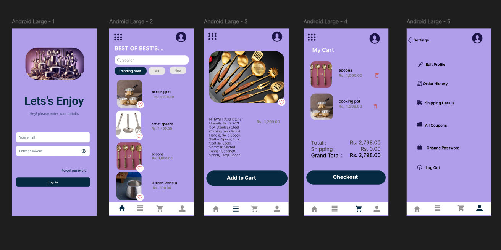
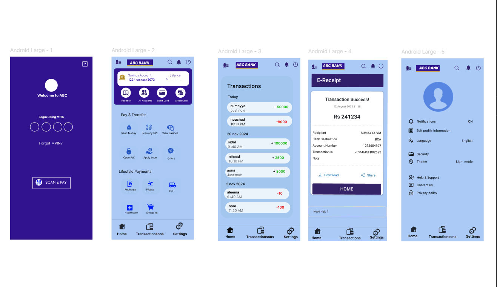

# 🎨 Figma Project

As a beginner in Figma, I tried designing two simple UI projects — a **Kitchen App** and a **FedMobile clone**.  
These designs helped me explore layout, color, and component basics in Figma.

## 🖼️ Design Previews
| Kitchen App | FedMobile Clone |
|--------------|----------------|
|  |  |

